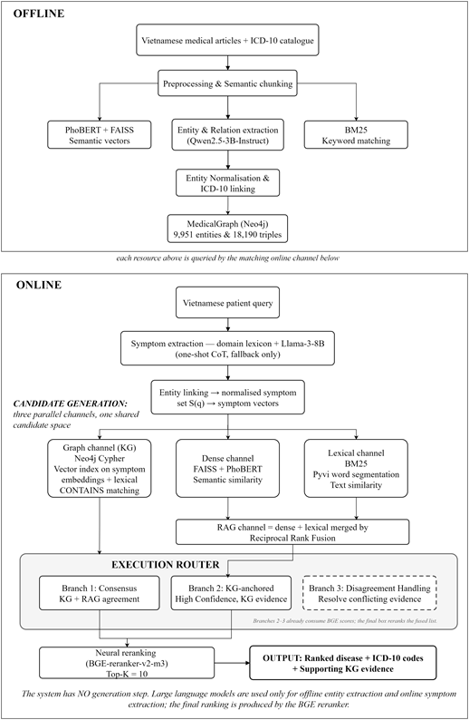

# MedKG-HRR: Đồ Thị Tri Thức Y Khoa Neo ICD-10 và Khung Truy Xuất Kết Hợp Tái Xếp Hạng

[](https://www.python.org/)
[](https://fastapi.tiangolo.com)
[](https://neo4j.com/)
[](https://github.com/facebookresearch/faiss)
[](https://github.com/VinAIResearch/PhoBERT)


## 1. Tổng Quan

MedKG-HRR là khung xếp hạng chẩn đoán phân biệt y tế dựa trên triệu chứng ngôn ngữ tự nhiên tiếng Việt, neo danh mục chuẩn quốc tế **ICD-10** (1.109 thực thể bệnh học Thế hệ B) thông qua đồ thị tri thức Neo4j và mạng nơ-ron tái xếp hạng.


## 2. Kiến Trúc Hệ Thống

<p align="center">
  
</p>

### Các Đặc Điểm Cốt Lõi:
* **Trích xuất Triệu chứng Tự động**: Bóc tách triệu chứng từ câu truy vấn bằng thuật toán Dict Matching kết hợp vector hóa ngữ nghĩa PhoBERT.
* **Truy xuất Lai 3 Kênh Song Song (Candidate Generation)**:
  * *Kênh Đồ thị (Neo4j KG)*: Truy vấn Cypher 4 tín hiệu (Vector Index 768d, Bigram, Unigram, Symptom CONTAINS) trên 1.109 bệnh và 7.558 triệu chứng.
  * *Kênh Dày (FAISS Dense)*: Tìm kiếm vector ngữ nghĩa theo từng triệu chứng độc lập trên 8.214 văn bản y khoa phân tầng.
  * *Kênh Thưa (BM25 Okapi)*: Truy xuất từ khóa mở rộng trên tập tài liệu phân đoạn y tế.
* **Hợp nhất Xếp hạng Nghịch đảo (RRF $k=60$)**: Kết hợp kênh Dense và Sparse theo chuẩn công thức Reciprocal Rank Fusion.
* **Tái xếp hạng Nơ-ron (BGE Reranker v2-m3)**: Tinh chỉnh thứ tự ứng viên qua mô hình Cross-Encoder chuyên sâu (+16,67 pp Hit@1).
* **Bộ điều khiển Đồng thuận 3 Nhánh (Execution Router - Hybrid Fusion v11)**:
  * *Branch 1 (Consensus)*: Đồng thuận cao khi Top-1 KG trùng Top-1 RAG.
  * *Branch 2 (KG High Confidence)*: Neo vào đồ thị khi độ tin cậy đồ thị vượt trội ($C_{\text{KG}} \ge 0,85$).
  * *Branch 3 (Disagree / Disagreement Handling)*: Cân bằng trọng số và tái xếp hạng khi hai kênh bất đồng.
* **Giao diện Lâm sàng Tương tác**: Phân tích và giải thích hỗ trợ người bệnh qua Server-Sent Events (SSE).
   

## 3. Kết Quả Thực Nghiệm Chính (181 Ca Kiểm Thử Độc Lập)

Đánh giá độc lập bởi 2 bác sĩ chuyên khoa ($\kappa = 0,47$, chấm ở cấp 3 ký tự ICD-10). Chi tiết số liệu tại [`docs/so_lieu_chot.json`](docs/so_lieu_chot.json).

| Hệ thống | Không gian mã | Hit@1 | Hit@3 | Hit@5 | MRR |
|---|:---:|:---:|:---:|:---:|:---:|
| **MedKG-HRR (Of-record)** | **1.109 bệnh (Tập đóng)** | **3,31%** | **7,73%** | **11,60%** | **0,064** |
| *Llama-3-8B-Instruct* | 13.081 mã (Tự do) | 12,71% | 23,20% | 28,73% | 0,188 |
| *Phi-3.5-mini-instruct* | 13.081 mã (Tự do) | 12,15% | 22,65% | 28,18% | 0,181 |
| *Qwen2.5-7B-Instruct* | 13.081 mã (Tự do) | 11,60% | 20,44% | 26,52% | 0,172 |
| *PhoGPT-4B-Chat* | 13.081 mã (Tự do) | 0,55% | 0,55% | 0,55% | 0,006 |

**Các phát hiện chính:**
1. BGE Reranker cải thiện vượt trội **+16,67 pp Hit@1** so với truy xuất cơ sở.
2. Chuỗi suy luận Chain-of-Thought (TN7) tăng **+1,65 pp Hit@1** và **+6,63 pp Hit@5**.
3. Hợp tập của 10 hệ thống đạt **54/181 ca (29,83%)**, khẳng định tính bổ trợ cao giữa Đồ thị tri thức và LLM.


## 4. Cấu Trúc Thư Mục Dự Án

```text
MedicalGraph/
├── backend/                  # FastAPI Backend API
│   ├── config.py             # Cấu hình toàn hệ thống & tham số MedKG-HRR
│   ├── main.py               # Entry point ASGI Server
│   ├── routers/              # API endpoints (/api/chat, /api/search, /api/config)
│   └── services/             # Core engines (medkghrr_engine.py, rag_engine.py)
├── frontend/                 # Web Clinical Dashboard (HTML/CSS/JS thuần, Glassmorphism)
├── code/                     # Pipeline Dữ liệu, Đồ thị & Thí nghiệm Khoa học
│   ├── database/             # Import Neo4j v2 & Vector Embeddings
│   ├── rag/                  # Mã nguồn nghiên cứu of-record (medkgbert_dx.py)
│   ├── extract/              # Trích xuất triệu chứng và thực thể
│   ├── evaluate/             # Đánh giá độ chính xác, Fleiss' Kappa
│   └── thucnghiem_TN4_TN5/   # Notebooks tái lập các thí nghiệm TN1–TN7
├── data/                     # Dữ liệu chuẩn đã kiểm định (FAISS, CSV, PKL, Cache)
├── models/                   # Mô hình PhoBERT contrastive cục bộ
├── docs/                     # Tài liệu kiến trúc & Bảng số liệu chốt
├── .env.example              # Mẫu cấu hình môi trường
├── requirements.txt          # Danh sách dependencies đã phân nhóm
├── check_system.py           # Script kiểm tra sức khỏe hệ thống 1-click
└── README.md                 # Hướng dẫn sử dụng tổng thể (file này)
```

## 5. Khởi Chạy 

### Bước 1: Cài đặt môi trường
```powershell
python -m venv .venv
.venv\Scripts\Activate.ps1
python -m pip install -r requirements.txt
cp .env.example .env
```

### Bước 2: Khởi tạo dữ liệu Neo4j (Thế hệ B)
```powershell
python code/database/import_neo4j_v2.py
python code/database/embed_constractive.py
```
*Tạo Vector Index trong Neo4j Browser:*
```cypher
CREATE VECTOR INDEX trieu_chung_vector_index IF NOT EXISTS
FOR (t:TrieuChung) ON (t.embedding)
OPTIONS {indexConfig: {`vector.dimensions`: 768, `vector.similarity_function`: 'cosine'}};
```

### Bước 3: Kiểm tra và Khởi chạy Web
```powershell
python check_system.py
uvicorn backend.main:app --reload --port 8000
```
Truy cập giao diện: `http://localhost:8000`


## 6. Danh Mục API Chính

| Phương thức | Endpoint | Chức năng |
|:---:|---|---|
| `POST` | `/api/chat/stream` | Tương tác tư vấn lâm sàng thời gian thực (SSE) |
| `POST` | `/api/search` | Tra cứu Top-K bệnh lý ứng viên qua MedKG-HRR |
| `GET` | `/api/pipeline-info` | Trạng thái các thành phần pipeline |
| `GET` | `/api/config` | Lấy cấu hình runtime |


## 7. Tài Liệu Tham Khảo Kỹ Thuật

* Tài liệu kiến trúc chuyên sâu: [`docs/ARCHITECTURE.md`](docs/ARCHITECTURE.md)
* Bảng số liệu chính thức kèm mã băm SHA-256: [`docs/so_lieu_chot.json`](docs/so_lieu_chot.json)

## 8. Giấy Phép và Bản Quyền 

Dự án và toàn bộ mã nguồn được phát hành chính thức dưới giấy phép [**MIT License**](LICENSE) bởi **Nhóm Nghiên cứu MedKG-HRR (Copyright © 2026)**.

### Điều khoản Nghiên cứu & Trích dẫn Học thuật:
Mã nguồn, dữ liệu và trọng số phục vụ mục đích nghiên cứu khoa học trong lĩnh vực Tin học Y tế. Khi sử dụng tài nguyên từ dự án này trong các công bố khoa học hoặc sản phẩm phái sinh, vui lòng trích dẫn bài báo chính thức:

```bibtex
@article{medkghrr2026,
  title={Đồ thị tri thức y khoa tiếng Việt neo ICD-10 và khung truy xuất kết hợp MedKG-HRR phục vụ chẩn đoán phân biệt},
  author={Nhóm Nghiên cứu MedKG-HRR},
  journal={Bản thảo nghiên cứu khoa học (Version 16)},
  year={2026}
}
```

* **Tuyên bố miễn trừ trách nhiệm y khoa**: Khung hệ thống MedKG-HRR được phát triển nhằm mục đích nghiên cứu học thuật và hỗ trợ định hướng thông tin chẩn đoán phân biệt theo chuẩn ICD-10. Kết quả đầu ra của hệ thống không thay thế cho quyết định chẩn đoán hoặc chỉ định lâm sàng trực tiếp từ Bác sĩ chuyên khoa.